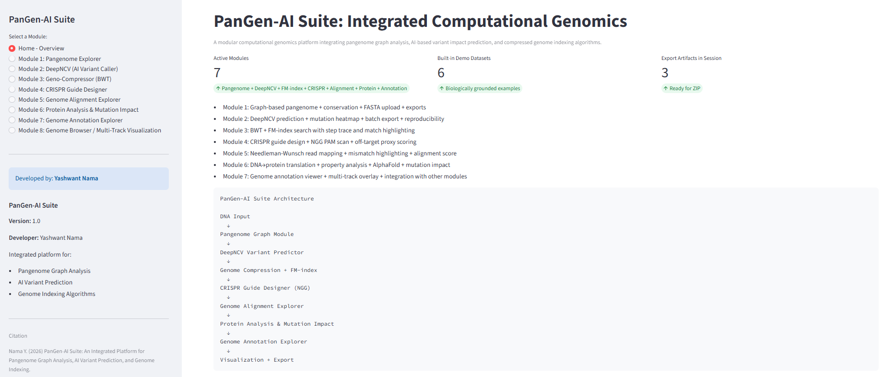

# 🧬 CD40-Immunosome  
### Systems Modeling Framework for CD40–TRAF6 Signaling and CRISPR Synergy

[](https://www.python.org/downloads/)
[](https://cd40-immunosome-tool-yash.streamlit.app/)
[](https://opensource.org/licenses/MIT)

[](https://doi.org/10.5281/zenodo.18850205)
---

## Overview
<p align="center">
  
</p>
**CD40-Immunosome** is a reproducible computational systems immunology framework for modeling feedback-regulated CD40–TRAF6 signaling dynamics and CRISPR-mediated perturbations.

The platform integrates:

- Ordinary Differential Equation (ODE) modeling of receptor-proximal signaling  
- SOCS1-mediated negative feedback simulation  
- Monte Carlo robustness analysis  
- Quantitative synergy scoring using area-under-the-curve (AUC) metrics  
- Interactive Streamlit-based visualization dashboard  

This repository accompanies the preprint:

> **Nama, Y. (2026).**  
> *CD40-Immunosome: A Systems Modeling Framework for CD40–TRAF6 Signaling and CRISPR Synergy.*

---

## Biological Motivation

CD40 activation plays a critical role in dendritic cell maturation and anti-tumor immunity. However, signaling amplitude and duration are tightly regulated by intracellular feedback loops, particularly **SOCS1-mediated attenuation**.

This framework addresses three key questions:

1. How does scaffold-mediated receptor clustering alter NF-κB dynamics?  
2. What is the quantitative impact of SOCS1 deletion on signaling persistence?  
3. Can multi-parameter modeling predict synergistic immunotherapeutic strategies?  

---

## Model Architecture

### 1️⃣ Core ODE System

The signaling network models:

- TRAF6 recruitment  
- NF-κB activation  
- SOCS1 negative feedback  

The system is numerically integrated using a fixed-step **Runge–Kutta 4th order (RK4)** solver over a 200-minute simulation window.

---

### 2️⃣ Null-Model Comparison

Feedback inhibition can be disabled (`k6 = 0`, `k7 = 0`) to simulate SOCS1-deficient conditions and compare:

- Transient activation (wild-type)  
- Sustained plateau dynamics (knockout)  

---

## 3️⃣ Monte Carlo Robustness Analysis

- ±20% stochastic perturbation of kinetic parameters  
- n = 50 simulations  
- Quantifies structural stability of transient peak dynamics  

---

## 4️⃣ CRISPR Synergy Quantification

Modified Bliss Independence metric:

```python
Synergy = (AUC_agonist_KO - AUC_agonist) / AUC_agonist * 100
```
Allows systematic comparison of simulated knockouts targeting:

- **SOCS1**  
- **PD-L1**  
- **CTLA-4**  
- **IL-10**  
---

## Interactive Dashboard

The Streamlit interface enables:

- Real-time kinetic parameter manipulation  
- Visualization of NF-κB temporal dynamics  
- Null-model comparisons  
- Monte Carlo sensitivity analysis  
- Automated synergy score export  

**Live Web App:**  
https://cd40-immunosome-tool-yash.streamlit.app/

---
## 📂 Repository Structure

```text
CD40-Immunosome-Tool/
│
├── app.py
├── requirements.txt
├── README.md
├── LICENSE
├── CITATION.cff
├── dashboard.png
└── assets/
```
---
## 🛠 Installation
**1️⃣ Clone the repository**
```
git clone https://github.com/YASH4-HD/CD40-Immunosome-Tool.git
cd CD40-Immunosome-Tool
```
**2️⃣ Install dependencies**
```
pip install -r requirements.txt
```
**3️⃣ Launch the dashboard**
```
streamlit run app.py
```
---
## 🔁 Reproducibility
All simulations are reproducible using:

- Deterministic RK4 solver
- Fixed parameter configuration
- Defined Monte Carlo perturbation range
- Explicit synergy scoring formula
- No proprietary datasets are required.
---

## 📜 Citation
If you use this suite in your research, please cite it as:
> **Nama, Y. (2026).** *CD40-Immunosome: A Systems Modeling Framework for CD40–TRAF6 Signaling and CRISPR Synergy (Version 1.0.1)
Zenodo. https://doi.org/10.5281/zenodo.18850205.* GitHub. [https://github.com/YASH4-HD/CD40-Immunosome-Tool](https://github.com/YASH4-HD/CD40-Immunosome-Tool)

---

## Author

**Yashwant Nama**  
*Independent Researcher | Systems Immunology & Computational Modeling*

**Focus:** Systems Immunology, Mechanobiology, Computational Modeling and Reproducible Bioinformatics.

🔗 **Connect & Verify:**
*   **ORCID:** [0009-0003-3443-4413](https://orcid.org/0009-0003-3443-4413)
*   **LinkedIn:** [Yashwant Nama](https://www.linkedin.com/in/yashwant-nama-232b2437b/)
*   **Project Website:** [Streamlit Dashboard](https://cd40-immunosome-tool-yash.streamlit.app/)


